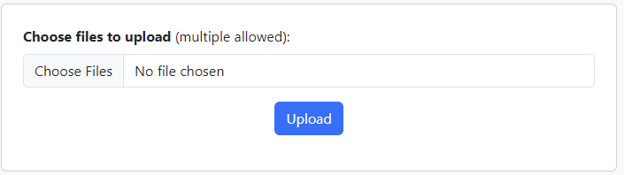
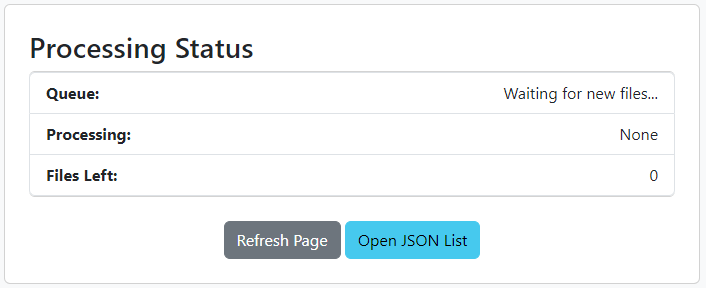

# AutomatedSlicerSegmentator
This project provides a set of Python scripts that create an automated pipeline for processing medical imaging files. The pipeline includes:
- Uploading the medical imaging files to a specified folder using a web interface.
- Automatically processing them using 3D Slicer's Total Segmentator extension.
- Exporting the resulting segmentation to a ```.gltf``` file using the OpenAnatomy Export extension.
- Using the web interface to view a list and download the processed outputs.

## Features
- **Queue Management**: Handles multiple files by queueing them and providing real-time status updates.
- **Real-Time Updates**: Displays current processing status, including files added, files in queue and files being processed.
- **3D Segmentation**: Uses the TotalSegmentator extension to segment medical imaging data.
- **Automated Cleanup**: Deletes input files after processing to manage disk space.
- **Export to GLFT**: Converts the segmentation output to ```.gltf``` format using the OpenAnatomy extension.
- **Web Interface for File Management**: Allows users to upload new files and download processes files through a web interface.

## Pre-Requisites
 This system was developed using the following OS and software versions.
 - **Operating System**: ```Windows 11```
 - **Python**: [```3.12```](https://www.python.org/downloads/)
 - **3D Slicer**: [```5.6.2```](https://download.slicer.org/)
 
 Other configurations may work, however only the above have been tested.

### Install Required Python Packages
#### **Watchdog**: used for file monitoring
```
pip install watchdog
```

#### **Flask**: used for file server
```
pip install flask
```

### Install 3D Slicer Extensions
#### Total Segmentator
- Open 3D Slicer
- Navigate to ```Extensions Manager```
- Search for ```Total Segmentator```
- Click ```Install```

#### OpenAnatomy Export
- Open 3D Slicer
- Navigate to ```Extensions Manager```
- Search for ```SlicerOpenAnatomy```
- Click ```Install```

## Usage Instructions
### 1. Configure Input and Output Folders
#### Web App variables (```webapp.py```)
Edit the following variables in the script to specify your paths:
```python
input_folder = r'directory/to/input/folder'
output_folder = r'directory/to/output/folder'
slicer_path = r'directory/to/Slicer.exe'
```

### 2. Running the Scripts
#### Start the Folder Monitoring Script
- Open a terminal or command prompt.
- Navigate to the directory containing ```webapp.py```.
- Run the script:
```
python webapp.py
```

The Flask app will start running on ```http://localhost:8080/```.

### 3. Processing files
#### **Uploading Files via Web Interface**
- Open a web browser and navigate to ```http://localhost:8080/upload```.
- Use the file selector to choose one or more medical imaging files to upload.
- Click **Upload**

Supported file types: ```.nrrd```, ```.nii```, ```.nii.gz```, ```.dcm```, ```.dicom```.



#### **Monitoring Processing Status**
The same tab will show real-time status updates, including:
- New Files added.
- Currently processing file.
- Number of files in the queue.



#### **Accessing Processed Files**
- **List Files**: Use the ```Open JSON List``` button on the page or navigate to ```http://localhost:8080/files``` to view a JSON list of processed files in a new file.
- **Download a File**: Navigate to ```http://localhost:8080/download/<filename>```, replacing ```<filename>``` with the actual filename.

Example:
```
http://localhost:8080/download/segmented_model.gltf
```

### 4. Stopping the Scripts
To stop the script and server, return to the  terminal window and press ```Ctrl+C```.

## Scripts Overview
### 1. ```webapp.py```
This script uses the ```watchdog``` library to monitor the input folder. Key functionalities include:
- **Folder Monitoring**: Detects new files added to the input folder.
- **Queue Management**: Adds new files to a processing queue and manages them efficiently.
- **Real-Time Status Updates**: Provides real-time console updates on processing status.
- **Processing Workflow**:
    - Starts 3D Slicer in the background using ```subprocess```.
    - Runs the ```slicer_processing.py``` script within 3D Slicer to perform segmentation
    - Deletes the input file after processing to manage disk space.

The script also provides a simple web interface to:
- **Upload Files**: Users can upload one or more medical imaging files to be automatically processed.
- **List Files**: Provides a JSON list of all files in the output folder.
- **Download Files**: Allows users to download specific files from the output folder.

### 2. ```slicer_processing.py```
This script runs inside 3D Slicer and performs the following:
- Loads the input medical image.
- Runs Total Segmentator to segment the image.
- Exports the segmentations to a ```.gltf``` file using ```OpenAnatomy Export```.
- Saves the output in the specified output folder.

## Enhancements and Future Work
- **Authentication**: Implement user authentication for the web interface to restrict access
- **PACS Server Integration**: Integrate the system with a PACS Server to securely retrieve and store medical images, ensuring compliance with medical regulations.

## Acknowledgements
- **3D Slicer**: An open source software platform for medical image informatics, image processing, and three-dimensional visualisation.
- **Total Segmentator**: An extension for 3D Slicer that provides automated segmentation of medical images.
- **OpenAnatomy Export**: An extension for exporting anatomical models in various formats.