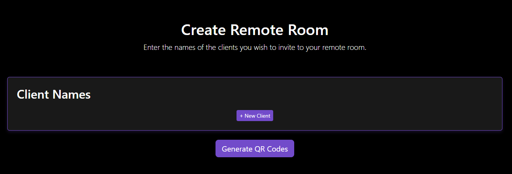

# XARhub

XARhub is a web-based application that provides a range of functionalities, including file uploading and downloading 
via QR codes, remote room creation with host/client QR codes and placeholders for advanced features like webRTC 
and image segmentation.

It offers a user-friendly interface for managing files and collaborating with others in both local and remote networks.

---

## Features
- **Web Interface for files**: Easily uploaded, list and manage any file type through a user-friendly web interface.
- **QR Code Downloads**: Generate QR codes for downloading files directly to devices connected in the same network.
- **Remote Rooms**: Create collaborative virtual rooms that generate unique host and client QR codes to connect remote users.
- **Place holders for Future Features**:
  - **WebRTC**: Integration for streaming video between computer sna headsets (in development)
  - **Segmentation**: Placeholder route for advanced medical image segmentation (in development)

---

## Pre-Requisites
This system was developed and tested on the following environment. Other configurations may work but have not been tested:
- **Operating System**: Windows 11
- **Python**: 3.12

### Python Dependencies
`pip install flask qrcode[pil] reportlab Pillow pywebview`
- **FLask**: Web framework for serving the application
- **qrcode**: Generating QR codes
- **reportlab**: Generating PDFs
- **Pillow (PIL)**: Image processing library
- **pywebview**: Native desktop window for the web app

---

## Project Structure
The project directory is structure as the following:
```
project_folder/
├── run.py
├── application/
│   ├── __init__.py
│   ├── config.py
│   ├── utils.py
│   ├── routes/
│   │   ├── __init__.py
│   │   ├── main.py
│   │   ├── files.py
│   │   ├── remote.py
│   │   ├── qr.py
│   │   ├── webrtc.py
│   │   └── segmentation.py
├── templates/
│   ├── home.html
│   ├── files.html
│   ├── remote.html
│   ├── remote_success.html
│   ├── segmentation.html
│   └── webrtc.html
├── static/
│   ├── css/
│   │   ├── bootstrap.min.css
│   │   └── styles.css
│   ├── js/
│   │   └── bootstrap.bundle.min.js
│   └── media/
│       ├── logo.png
│       └── simxar.png
├── uploads/ (created automatically)
└── codes/ (created automatically)
```
### Key Files
- `run.py`: The main entry point that starts the Flask server and opens the application in a desktop webview.
- `application/`: Contains the Flask app factory, configuration, utilities and route blueprints.
- `templates/`: HTML templates for rendering different pages.
- `static/`: Static files (CSS, JS, media).
- `uploads/`: Stores user uploaded files.
- `codes/`: Stores generated PDF with QR codes for remote sessions.

### Packaging as an Executable

This application can be packaged into a single executable using PyInstaller.
```
pyinstaller --name XARhub --onefile --windowed \
--add-data "templates;templates" \
--add-data "static;static" \
--add-data "uploads;uploads" \
--add-data "codes;codes" \
--icon=static/media/logo.ico run.py
```

--- 

## Using the Application
### Starting the Application
The application can be launched using the executable generated using the above command or by opening a terminal windows
in the project directory and running:

`python run.py`

The application will:
- Start a Flask server on the local port (default `8080`)
- Automatically determine the local IP address
- Open a desktop window using pywebview pointing to the application's home page

The app can also be accessed directly in the browser by navigating to:

`http://<your_local_ip>:8080`

replacing `<your_local_ip>` with the IP of the local machine.

### Home Page

Once the application is launched, the Home Page will be presented where the user has the option to choose where they would like to go.
- **File Loading**: Add, manage, download and generate QR codes for your files.
- **Remote Rooms**: Create a remote session with QR codes for hosts and clients.
- **WebRTC**: Placeholder page for future functionality.
- **Segmentation**: Placeholder page for future functionality.

### File Loading

Drag and dop or click on the dotted box to upload files to the server.
Uploaded files displays a list of files which can have a QR code generated or can be deleted.

### Remote Rooms

Click on `+ New Client` to add a new client to invite. Names can be assigned to each of the clients.


Once ready, click `Generate QR Codes` which will open the landing page and PDFs create will be found in the `codes/` directory.

### Other Pages
**WebRTC** and **Segmentation** are placeholders which load static templates. 